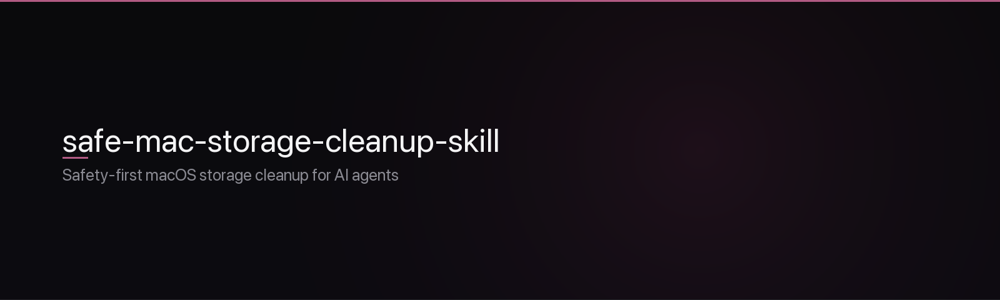

<div align="center">



**Production-ready, safety-first macOS storage cleanup for AI agents**

Codex · Claude Code · Cursor · Grok · any Agent Skills–compatible tool

<br />

[](LICENSE)
[](https://www.apple.com/macos/)
[](https://www.python.org/)
[](https://nodejs.org/)

[](#safety-guarantees)
[](#safety-guarantees)
[](#usage)
[](#whats-included)
[](https://www.npmjs.com/package/safe-mac-storage-cleanup-skill)

<br />

```bash
npx safe-mac-storage-cleanup-skill@latest
```

Then tell your agent: *“My disk is full — run the safe mac storage cleanup.”*

</div>

---

## Why this exists

Most “Mac storage cleanup for agents” repos are engagement bait: incomplete helpers, hard-coded author paths, and vague safety claims that still leave the model free to invent `rm -rf`.

This skill is the opposite: **portable, enforced in code, and interactive by design.**

| Problem in the original | What this skill does |
| ----------------------- | -------------------- |
| Hard-coded paths like `/Users/francescomistero/...` | Portable paths for any user |
| Stub or missing helpers | Full audit + validated cleanup scripts |
| “Trust me” safety copy | Whitelist + audit JSON gate in `safe_cleanup.py` |
| Single-commit, no multi-agent story | `SKILL.md` + install targets for major agents |
| Agents inventing dangerous `rm` | Prefer native Trash; never suggest raw `rm` |

---

## Safety guarantees

These are non-negotiable. The scripts enforce them; the agent is instructed to follow them.

| Guarantee | Behavior |
| --------- | -------- |
| **Read-only audit first** | No modifications until you approve specific items |
| **Strict whitelist only** | Caches, logs, package caches, dev artifacts, Trash, temps — not Documents, Desktop, Photos, Keychains, Mail, iCloud, or system roots |
| **Path validation gate** | Cleanup refuses paths outside the whitelist or missing from a recent audit report |
| **Trash by default** | Finder Trash (recoverable). Permanent delete only with extra confirmation + `--permanent` |
| **No sudo by default** | No privilege escalation unless you explicitly approve it |
| **Reviewable output** | Markdown report for humans + JSON for the agent |
| **Logged actions** | Proposed and executed cleanups are logged |

**You stay in control.** Phrases like “just clean it” only apply to **already-listed low-risk items** from the current audit. Everything else needs explicit path approval.

---

## Installation

### Option 1 — npx (recommended)

```bash
npx safe-mac-storage-cleanup-skill@latest
```

Installs into common skill locations and detects your setup.

### Option 2 — Manual / multi-agent

```bash
git clone https://github.com/ChloeVPin/safe-mac-storage-cleanup-skill.git
cd safe-mac-storage-cleanup-skill

# Codex / agents using ~/.agents/skills or ~/.codex/skills
mkdir -p ~/.agents/skills/mac-storage-cleanup
cp -r skill/* ~/.agents/skills/mac-storage-cleanup/

# Claude Code
mkdir -p ~/.claude/skills/mac-storage-cleanup
cp -r skill/* ~/.claude/skills/mac-storage-cleanup/

# Cursor / Grok / others — use your agent’s skills directory
# (same: copy the contents of skill/)
```

The portable unit is the `skill/` folder (`SKILL.md` + helpers).

### Option 3 — Bash installer

```bash
curl -fsSL https://raw.githubusercontent.com/ChloeVPin/safe-mac-storage-cleanup-skill/main/install.sh | bash
```

Or run `./install.sh` after clone (prompts for target agent(s)).

**After install**, say:

> Use the mac-storage-cleanup skill

or

> My disk is full, run storage cleanup

---

## Usage

Fully interactive. Every session follows the same loop.

```text
  trigger  →  audit (read-only)  →  review table  →  approve paths
      →  safe_cleanup (validated)  →  df before/after  →  next steps
```

1. **Trigger** — e.g. *“Scan for wasted space and show me what I can safely delete.”*
2. **Audit** — agent runs `python3 …/scripts/storage_audit.py --output /tmp/mac-audit`
3. **Report** — ranked Markdown + JSON + low-risk-first recommendations
4. **Approve** with exact intent, for example:
   - “Trash the top 5 largest caches and all logs”
   - “Delete Xcode DerivedData and old simulators (permanent ok)”
   - “Show details on the `node_modules` entries first”
   - “Only low-risk items under 5GB total”
5. **Cleanup** — `safe_cleanup.py` with approved paths only (dry-run summary, then final “yes, proceed”)
6. **Verify** — `df -h /` delta + follow-ups (restart Xcode, empty Trash in Finder for permanent free space)

Partial scans are supported, e.g. `--category caches logs developer`.

---

## What's included

| Path | Role |
| ---- | ---- |
| `skill/SKILL.md` | Agent instructions + safety rules |
| `skill/scripts/storage_audit.py` | Read-only scanner; JSON + Markdown; zero Python deps |
| `skill/scripts/safe_cleanup.py` | Validation layer; dry-run / trash / guarded permanent |
| `skill/scripts/utils.py` | Size formatting, path safety, logging |
| `skill/references/safety.md` | Deep safety reference |
| `docs/` | Example reports |
| `bin/`, `install.sh` | Distribution + multi-agent install |

---

## Cleanup categories

### Low risk

Usually safe to trash after a quick review.

- User and app caches (`~/Library/Caches/*`)
- Logs (`~/Library/Logs/*`)
- Package manager caches (npm, pnpm, yarn, pip, cargo, go, brew)
- Stale `/tmp` and `/private/tmp`
- `~/.Trash` (empty)
- Old Xcode DerivedData and unavailable simulators

### Medium risk

Review carefully before approving.

- Large `node_modules` (may be active projects)
- Docker build cache / images / volumes
- Old items in `~/Downloads` (listed separately, high caution)
- Project build artifacts (only if you know they are stale)

### Never touched

- `~/Documents`, `~/Desktop`, `~/Pictures`, `~/Music`, `~/Movies`, `~/Public`
- Photos libraries, iCloud / Mobile Documents, Mail, Keychains, user databases in Application Support
- System `/`, `/System`, `/Library` (except explicitly safe user-writable caches)
- Active source repos and important projects (flagged for review only)
- Anything needing `sudo` unless you explicitly approve

---

## Limitations

- Not a duplicate finder or photo library cleaner — use dedicated tools for those.
- Built for interactive, user-driven sessions — not unattended cron (you can extend it).
- Regenerating large caches can make some apps slower until caches rebuild.
- Keep a recent Time Machine or cloud backup before any cleanup session.
- Prefer testing on a non-critical Mac if you want extra caution.

---

## Development

Goal: a gold standard for safe, agent-driven macOS maintenance.

PRs welcome for:

- Additional safe categories (with justification + example paths)
- Faster size calculation
- Guarded integrations (`brew cleanup`, `docker system prune`, `xcrun simctl`, …)
- Future Windows / Linux analogs

```bash
# Manual smoke test on your Mac
python3 skill/scripts/storage_audit.py --output /tmp/mac-audit --min-size-mb 100
python3 skill/scripts/safe_cleanup.py --help
```

---

## License

[MIT](LICENSE) — use freely, improve it, and share the safe way to clean Macs with agents.

---

<div align="center">

**Built as a real replacement for engagement-bait stubs.**

Paste this repo URL into your agent and say *“install and run the safe version.”*

[](https://github.com/ChloeVPin/safe-mac-storage-cleanup-skill)
[](https://github.com/ChloeVPin/safe-mac-storage-cleanup-skill/issues)
[](https://github.com/ChloeVPin/safe-mac-storage-cleanup-skill/commits/main)

</div>

---

## Testing (controlled sandbox)

The skill ships with a **fake-HOME sandbox** that never touches your real files:

```bash
./tests/run_sandbox.sh
```

It seeds disposable caches/logs under a temp home, verifies the audit only lists whitelist paths, refuses Documents/Desktop/Mail/Keychains, and runs a dry-run → Trash agent-style workflow. The sandbox directory is deleted on exit.
