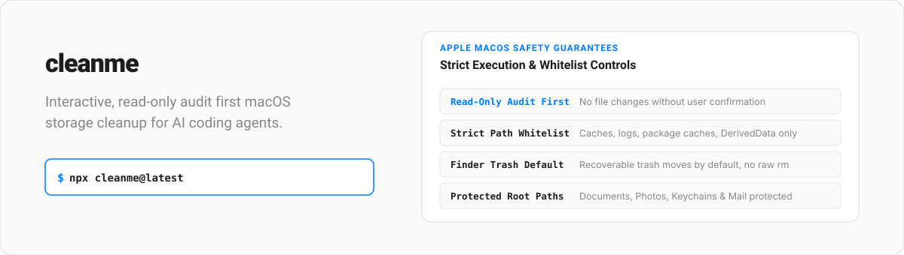
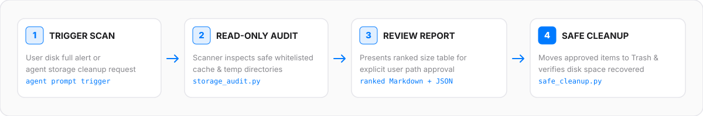

<p align="center">
  
</p>

<p align="center">
  <a href="LICENSE">
    
  </a>
  
  <a href="https://www.npmjs.com/package/cleanme">
    
  </a>
  
</p>

---

## Overview

`cleanme` is a portable, code-enforced, interactive skill that enables AI coding agents to safely audit and clean wasted disk space on macOS.

Unlike incomplete cleanup scripts or dangerous prompts that risk executing destructive commands like `rm -rf`, this skill operates under strict architectural guarantees: read-only audits first, whitelist path validation, Finder Trash safety, and zero privilege escalation by default.

<br />

<p align="center">
  
</p>

---

## Safety Architecture & Guarantees

Every cleanup operation is strictly enforced by code in `skill/scripts/safe_cleanup.py`:

| Safety Guarantee | Code Enforced Behavior |
|---|---|
| **Read-Only Audit First** | Performs a full system scan and generates a report before proposing any file deletions. |
| **Strict Whitelist Policy** | Restricts cleanup targets exclusively to safe caches, logs, package caches, build artifacts, and Trash. |
| **Path Validation Gate** | Rejects any paths outside the whitelist or omitted from the active audit report. |
| **Finder Trash Default** | Moves approved files to Finder Trash (recoverable). Permanent removal requires explicit confirmation and `--permanent`. |
| **Protected Root Safeguards** | Documents, Desktop, Pictures, Photos, Keychains, Mail, and system roots are strictly un-touchable. |
| **Zero Sudo Escalation** | Executes without elevated privileges unless explicitly authorized for a specific task. |

---

## Quick Installation

### Option 1: Community Skills CLI (Recommended)

```bash
npx cleanme@latest
```

### Option 2: Manual Multi-Agent Installation

```bash
git clone https://github.com/ChloeVPin/cleanme.git
cd cleanme

# Install for Agent Skills / Codex (~/.agents/skills)
mkdir -p ~/.agents/skills/cleanme
cp -r skill/* ~/.agents/skills/cleanme/

# Install for Claude Code (~/.claude/skills)
mkdir -p ~/.claude/skills/cleanme
cp -r skill/* ~/.claude/skills/cleanme/

# Install for OpenCode (~/.config/opencode/skills)
mkdir -p ~/.config/opencode/skills/cleanme
cp -r skill/* ~/.config/opencode/skills/cleanme/
```

### Option 3: Automated Installer Script

```bash
curl -fsSL https://raw.githubusercontent.com/ChloeVPin/cleanme/main/install.sh | bash
```

---

## Interactive Workflow Execution

1. **Trigger Scan**: Prompt your agent: *"My disk is full, run cleanme."*
2. **Audit Execution**: The agent runs `python3 skill/scripts/storage_audit.py --output /tmp/cleanme-audit`
3. **Report Presentation**: A ranked Markdown + JSON breakdown is rendered with itemized space usage.
4. **User Path Approval**: You select exact items to trash (for example: *"Trash the top 3 largest caches and Xcode DerivedData"*).
5. **Validated Cleanup**: `safe_cleanup.py` executes dry-run validation followed by safe file removal to Trash.
6. **Verification Delta**: `df -h /` disk space recovery is reported to verify reclaimed space.

---

## Category Whitelist Matrix

### Low Risk (Safe to Trash)
- User and application caches (`~/Library/Caches/*`)
- System and user log files (`~/Library/Logs/*`)
- Package manager caches (`npm`, `pnpm`, `yarn`, `pip`, `cargo`, `go`, `brew`)
- Stale temporary files (`/tmp` and `/private/tmp`)
- Trash folder contents (`~/.Trash`)
- Old Xcode DerivedData and unavailable iOS simulators

### Medium Risk (Explicit Review Required)
- Large `node_modules` directories in inactive projects
- Docker build cache, images, and stopped container volumes
- Stale files in `~/Downloads` (itemized separately)

### Protected Paths (Never Touched)
- `~/Documents`, `~/Desktop`, `~/Pictures`, `~/Music`, `~/Movies`, `~/Public`
- Photos libraries, Mobile Documents, Mail databases, Keychains, and Application Support databases
- System directories (`/`, `/System`, `/Library`)

---

## Repository Anatomy

```text
cleanme/
├── skill/
│   ├── SKILL.md                     # Agent instruction context & safety rules
│   ├── scripts/
│   │   ├── storage_audit.py         # Read-only scanner (zero Python dependencies)
│   │   ├── safe_cleanup.py          # Path validation & Trash move engine
│   │   └── utils.py                 # Size calculation & path safety helpers
│   └── references/
│       └── safety.md                # Deep safety reference documentation
├── bin/                             # CLI executable entry points
├── tests/                           # Controlled fake-HOME sandbox test suite
├── docs/                            # Documentation and examples
├── install.sh                       # Multi-agent installation script
└── package.json                     # npm package configuration
```

---

## Controlled Sandbox Testing

Test the cleanup workflow safely without touching your real files:

```bash
./tests/run_sandbox.sh
```

The sandbox creates a disposable temporary environment, populates fake caches, verifies path whitelist enforcement, and confirms that protected folders are strictly inaccessible.

---

## Troubleshooting

### python3 not found

If you see `env: python3: No such file or directory`, install Python 3.8+ from [python.org](https://www.python.org) or via Homebrew:

```bash
brew install python3
```

### Permission denied during cleanup

If a file or directory cannot be moved to Trash or deleted, check:
- Is the file owned by root? Use `sudo` only if you understand the risk.
- Does the file have immutable flags? Remove with `chflags -R nouchg <path>`.
- Is the file open in another app? Close the app and retry.

### Audit finds no items

If the audit reports no findings:
- Lower the size threshold: add `--min-size-mb 50` to the audit command.
- Check that the target directories exist and contain data.
- Verify you are scanning the correct HOME directory.

### Trash is full

If Trash cannot accept more files, empty it in Finder or run:

```bash
rm -rf ~/.Trash/*
```

### Cleanup fails partway

If some paths fail during cleanup:
- Review the error message for each failed path.
- Do not retry automatically; investigate the cause first.
- Re-run the audit to get an updated list of safe paths.

## Recovery

Files moved to Trash can be restored from the Finder Trash folder until it is emptied. To restore:
1. Open Finder.
2. Open the Trash folder.
3. Right-click the file and select "Put Back".

If you used `--mode permanent`, the files are irreversibly deleted. Do not use permanent mode unless you are certain.

---

## License

Available under the [MIT License](LICENSE).
